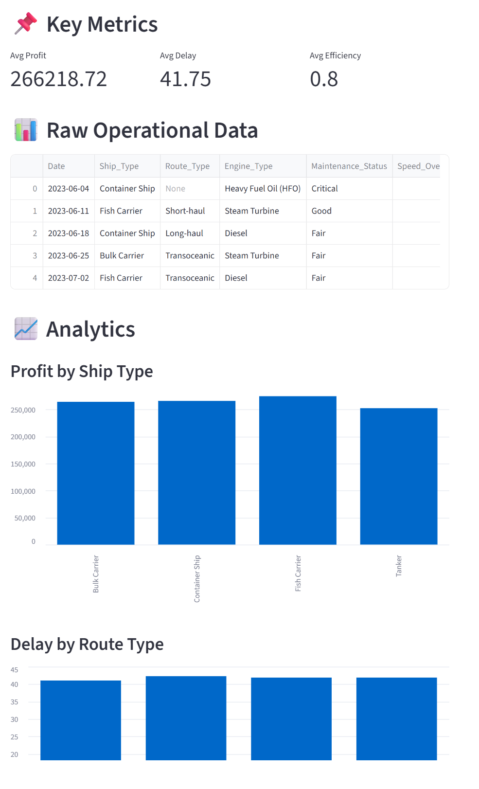

# 🚢 Maritime Performance Optimization System



## 📌 Overview

This project simulates a real-world maritime operations analytics system designed to improve efficiency, reduce delays, and optimize profitability using data-driven insights.

It is built as an end-to-end **data analytics and decision-support system** that processes ship performance data and transforms it into actionable business recommendations.

The system evaluates:
- Profitability  
- Operational efficiency  
- Route delays  

and provides optimization insights to support better decision-making in maritime and logistics operations.

---

## 🎯 Key Features

### 📊 KPI Engine
- Profit calculation per voyage
- Efficiency classification
- Delay risk identification

### 📈 Analytics & Insights
- Profit comparison across ship types
- Delay analysis by route
- Efficiency evaluation by engine type

### 🔥 Automated Insights
- Best & worst performing ship types
- Most delayed routes
- Most efficient engine configurations

### 🚀 Optimization Engine
- Generates actionable recommendations:
  - Improve low-performing ship types
  - Reduce route delays
  - Optimize engine selection

### 🖥️ Interactive Dashboard
Built using **Streamlit**:
- Real-time visualizations
- KPI metrics
- Summary insights
- Optimization recommendations

---

## 🧱 Project Structure


```
quality-pmo-optimization-system/
│
├── README.md
├── requirements.txt
├── .gitignore
│
├── data/
│   ├── raw/
│   ├── processed/
│   └── sample_shipping_data.csv
│
├── notebooks/
│   ├── 01_eda.ipynb
│   ├── 02_kpi_analysis.ipynb
│   ├── 03_process_analysis.ipynb
│
├── src/
│   ├── data/
│   │   ├── load_data.py
│   │   ├── preprocess.py
│   │
│   ├── analytics/
│   │   ├── kpi_tracker.py
│   │   ├── delay_analysis.py
│   │   ├── root_cause.py
│   │
│   ├── pmo/
│   │   ├── project_tracker.py
│   │   ├── milestone_manager.py
│   │   ├── stakeholder_simulation.py
│   │
│   ├── process/
│   │   ├── current_state.py
│   │   ├── future_state.py
│   │   ├── optimization.py
│   │
│   └── utils/
│       ├── config.py
│       ├── logger.py
│
├── dashboard/
│   ├── app.py
│   └── components/
│
├── reports/
│   ├── project_status_report.md
│   ├── process_improvement_report.md
│
├── docs/
│   ├── architecture.md
│   ├── methodology.md
│   ├── stakeholder_map.md
│
└── tests/
    ├── test_kpi.py
    ├── test_pipeline.py
```

---

## ⚙️ How to Run

### 1. Create virtual environment
python -m venv venv
.\venv\Scripts\Activate.ps1

### 2. Install dependencies
pip install pandas streamlit

### 3. Run the dashboard
streamlit run dashboard/app.py
---

## 📊 Features

* KPI tracking system
* Project & milestone monitoring
* Delay and root cause analysis
* Process optimization suggestions
* Interactive dashboard

---

## 🚀 Future Improvements

* Integration with real-world datasets
* Machine learning for predictive analytics
* Automated reporting using LLMs

---

## 👨‍💻 Author

**Md Abrar Fahim**  
B.Sc. Information Engineering — HAW Hamburg
